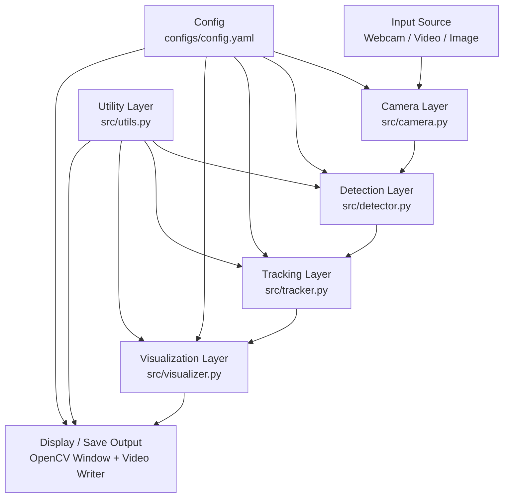

# Real-Time Object Detection and Tracking: Complete Architecture and Working Guide

## 1. Purpose of This Document

This document is a full-system explanation of the project so that the team can confidently answer technical, implementation, and demo questions during reviews, viva, interviews, and project evaluations.

It explains:

- What the project does and why it is designed this way
- End-to-end architecture and data flow
- Responsibilities of each file/module
- How the project runs in each mode (live camera, video, image)
- Configuration and tuning strategy
- Error handling and fallback behavior
- Performance considerations on Ubuntu 22.04 VM
- Probable questions and model answers

## 2. Project at a Glance

### Objective

Build a robust, demo-ready, VM-friendly real-time object detection and tracking system using YOLOv8 and modern tracking overlays.

### Core Capabilities

- Real-time object detection with Ultralytics YOLOv8
- Multi-object tracking with persistent IDs (ByteTrack or BoT-SORT)
- On-screen overlays: bounding boxes, labels, confidence, track IDs, FPS, and object counts
- Config-driven behavior through one YAML file
- CPU-first execution with automatic CUDA fallback
- Scripts for setup and model download automation

### Why This Stack

- YOLOv8 gives strong detection quality with simple API
- YOLOv8n runs fast enough on CPU for VM demos
- Ultralytics built-in tracking reduces integration complexity
- Supervision provides high-quality visual annotations
- OpenCV provides universal camera/video/image I/O

## 3. High-Level Architecture



### Layer Responsibilities

- Camera Layer: acquires frames from webcam/file source
- Detection Layer: runs object detection and returns normalized detection objects
- Tracking Layer: assigns persistent IDs and accumulates unique-object stats
- Visualization Layer: draws rich annotated output on frames
- Utility Layer: config load, device selection, FPS math, logging format, output folder management

## 4. Runtime Entry Points

This project supports 3 execution paths.

## 4.1 Live Pipeline (main.py)

Command:

```bash
python main.py
```

Flow:

1. Parse config path argument (default: configs/config.yaml)
2. Load config
3. Initialize CameraSource
4. Initialize ObjectDetector
5. Initialize ObjectTracker
6. Initialize Visualizer
7. Optionally initialize video writer if output.save_video=true
8. Loop over frames:
   - Read frame
   - Detect objects
   - Track objects
   - Compute FPS
   - Draw overlay and annotations
   - Show frame (cv2.imshow)
   - Save frame if output enabled
9. Exit on Q or ESC
10. Print summary:
   - total frames
   - average FPS
   - unique objects per class

## 4.2 Video File Pipeline (run_on_video.py)

Command:

```bash
python run_on_video.py /path/to/video.mp4
```

Differences from live mode:

- Input source is forced to the CLI video path
- Output saving is forced on (`output.save_video=true` in memory)
- Shows processed video window and writes output file

## 4.3 Single Image Pipeline (run_on_image.py)

Command:

```bash
python run_on_image.py /path/to/image.jpg --save
```

Flow:

1. Load image
2. Run detection once
3. Convert detections to pseudo-tracked objects (synthetic IDs)
4. Annotate frame using same visualizer pipeline
5. Display result
6. Optionally save output image

## 5. Component Deep Dive

## 5.1 src/camera.py

Class: `CameraSource`

Purpose:

- Open webcam index or video file using OpenCV
- Normalize source (string "0" -> int 0)
- Apply capture settings from config (width, height, fps_target)

Methods:

- `read()` -> `(success, frame)`
- `release()` -> releases cv2 VideoCapture

Error Behavior:

- Raises RuntimeError with troubleshooting hint if source cannot open

## 5.2 src/detector.py

Class: `ObjectDetector`

Purpose:

- Load YOLO model from config path
- Select device (auto/cuda/cpu) using utility helper
- Run detection with confidence and IOU thresholds from config
- Optional class filtering by IDs or class names

Input:

- Frame (numpy array)

Output Format:

Each detection is normalized to dictionary form:

- bbox: [x1, y1, x2, y2]
- confidence: float
- class_id: int
- class_name: str

Notes:

- `classes_to_track` can accept IDs or names (e.g., [0,2] or [person,car])
- Detection failures return empty list and log [ERROR] without hard crash

## 5.3 src/tracker.py

Class: `ObjectTracker`

Purpose:

- Wrap Ultralytics tracking mode with configurable tracker backend
- Support `bytetrack` and `botsort`
- Produce tracked objects with persistent IDs
- Maintain unique object counts by class for summary reporting

Important Implementation Detail:

- `update(detections, frame)` currently runs `model.track(...)` directly on frame
- The `detections` argument is used as fallback when tracking output fails/empty

Output Format:

Tracked object dictionary includes:

- bbox
- confidence
- class_id
- class_name
- track_id

Statistics:

- `get_unique_object_counts()` returns per-class unique IDs seen
- `get_total_unique_objects()` returns global total

## 5.4 src/visualizer.py

Class: `Visualizer`

Purpose:

- Convert tracked objects into Supervision `Detections`
- Draw:
  - Bounding boxes
  - Labels
  - Confidence
  - Track IDs
  - Traces
- Draw semi-transparent top-left status panel with:
  - FPS
  - object count in current frame
  - total unique objects

Design Choice:

- Same visualizer used by all run modes for consistent demo output

## 5.5 src/utils.py

Key functions:

- `load_config(path)`
- `get_device(preferred='auto')`
- `calculate_fps(prev_time)`
- `setup_output_directory(config)`
- `log_message(level, message)`

Logging Contract:

- Timestamped messages with severity tags
- Expected levels in this project: INFO, SUCCESS, ERROR

## 6. Configuration Strategy (Single Source of Truth)

Config file: `configs/config.yaml`

## 6.1 detection

- `model_path`: model file path
- `confidence_threshold`: minimum confidence for detection
- `iou_threshold`: overlap threshold during detection process
- `device`: auto/cuda/cpu
- `classes_to_track`: empty for all classes, or selected subset

## 6.2 tracking

- `tracker`: bytetrack or botsort
- `max_disappeared`: currently retained for compatibility and future extension

## 6.3 camera

- `source`: webcam index or file path
- `width`, `height`: capture size
- `fps_target`: desired processing/output FPS target

## 6.4 display

- show_fps, show_labels, show_confidence, show_track_id
- bbox_thickness

## 6.5 output

- save_video: enable/disable video writing
- output_path: target file path for output media

## 7. Error Handling and Graceful Degradation

### 7.1 CPU Fallback

- Device is selected using `get_device`
- If CUDA is unavailable, system automatically uses CPU
- This avoids hard failure in VM environments

### 7.2 Non-Crash Philosophy

- Detection exceptions return empty detections and log error
- Tracking exceptions fallback to detection objects with synthetic negative IDs
- Main entry points catch top-level errors and print troubleshooting hints

### 7.3 Clean Shutdown

All entry points release resources in `finally` blocks:

- Release VideoWriter
- Release CameraSource
- Destroy OpenCV windows

## 8. Setup and Automation Design

## 8.1 setup.sh

Automates:

1. Python availability/version check
2. venv creation (or reuse)
3. pip upgrade
4. dependency installation
5. model download script execution
6. next-step command guidance

## 8.2 download_models.sh

Automates:

- `models/` directory creation
- download of required `yolov8n.pt`
- optional download of `yolov8s.pt`
- existence and size checks
- guidance for switching model in config

## 9. Performance Model for Ubuntu VM

## 9.1 Default Profile (Recommended)

- model: yolov8n
- tracker: bytetrack
- resolution: 1280x720 (reduce if needed)
- fps_target: 30 (reduce for weak VM)

## 9.2 If FPS Is Low

Tune in this order:

1. Lower resolution to 640x480
2. Keep yolov8n
3. Reduce fps_target (e.g., 20)
4. Filter classes to fewer targets
5. Ensure host and VM are not overloaded

## 10. Testing Strategy

Test file: `tests/test_pipeline.py`

Coverage intent:

- Config loading test
- Detector initialization test
- Dummy-frame detect test
- Visualizer draw test

Design note:

- Uses fake YOLO class for deterministic/offline tests
- Supports quick smoke validation in CI or local setup

## 11. Known Limitations and Practical Notes

1. Live display uses `cv2.imshow`, which requires a working GUI session
2. Tracking currently calls model.track on full frame; not a separate external tracker state machine
3. `max_disappeared` exists in config but is not currently used to control tracker internals directly
4. Output writer FPS follows `camera.fps_target`, actual achieved FPS depends on hardware
5. On headless VMs, prefer video-file processing and output saving over live display

## 12. Architecture Rationale (Why This Is Defensible in Viva)

- Modular separation improves maintainability and testing
- Config-driven behavior avoids hardcoded magic values
- CPU fallback improves portability for demo environments
- Unified visualizer keeps output consistent across modes
- Entry point split (main/video/image) improves user experience and troubleshooting
- Setup automation reduces environment-related demo failures

## 13. End-to-End Demo Narrative (2-Minute Explanation)

Use this in presentations:

1. This system captures frames from webcam or file input.
2. Each frame goes through YOLOv8 detection for object localization and class prediction.
3. Tracking then assigns persistent IDs to maintain object identity across frames.
4. Visualizer renders boxes, labels, confidence, traces, and live statistics.
5. The same pipeline works in live, video, and image modes, fully controlled by one YAML configuration.
6. It is VM-friendly because device selection auto-falls back to CPU and setup is automated with scripts.

## 14. Probable Questions and Suggested Answers

## A. Architecture and Design

1. **Q: Why did you separate detector, tracker, and visualizer?**  
   **A:** To enforce single responsibility, improve maintainability, and allow isolated testing/tuning of each stage.

2. **Q: Why use config.yaml instead of constants in code?**  
   **A:** It allows runtime tuning without code changes, improves reproducibility, and makes demos safer and faster.

3. **Q: Why are there separate entry scripts for main/video/image?**  
   **A:** Each mode has different UX and I/O requirements. Separation keeps logic clear and reduces conditional complexity.

4. **Q: What is the main data structure passed across modules?**  
   **A:** A normalized dictionary list containing bbox, confidence, class ID/name, and optionally track ID.

5. **Q: Is this architecture monolithic or layered?**  
   **A:** Layered pipeline with modular components and centralized utility/config layer.

## B. Detection and Tracking

6. **Q: Which model is used by default and why?**  
   **A:** YOLOv8n because it is fast and CPU-friendly for VM-based real-time demos.

7. **Q: How is GPU/CPU selected?**  
   **A:** Through `get_device`; auto chooses CUDA if available, otherwise CPU.

8. **Q: Which trackers are supported?**  
   **A:** ByteTrack and BoT-SORT via Ultralytics tracker config files.

9. **Q: How are classes filtered?**  
   **A:** `classes_to_track` in config; supports IDs or names.

10. **Q: What happens if tracking fails?**  
    **A:** Fallback returns detection-based objects with synthetic negative track IDs to keep pipeline alive.

11. **Q: How are unique object counts computed?**  
    **A:** Track IDs are stored in per-class sets; set sizes give unique counts.

12. **Q: Why do you still call detect if track does inference again?**  
    **A:** Detect output serves as normalized fallback path and keeps module interfaces explicit and extensible.

## C. Performance and VM Readiness

13. **Q: How do you handle low FPS in VM?**  
    **A:** Use yolov8n, reduce resolution, lower fps_target, limit classes, and reduce host/VM load.

14. **Q: Why not use larger model by default?**  
    **A:** Reliability in VM demos is prioritized over peak accuracy.

15. **Q: Is this real-time on CPU?**  
    **A:** Yes, for moderate resolutions and lightweight models; exact FPS depends on VM resources.

16. **Q: What are the biggest FPS bottlenecks?**  
    **A:** Inference cost, frame resolution, and rendering/display overhead.

17. **Q: How is FPS computed?**  
    **A:** Inverse of frame-to-frame processing interval (`1/delta_time`).

## D. Reliability and Operations

18. **Q: How do you ensure setup reproducibility?**  
    **A:** Dedicated `setup.sh`, version-bounded dependencies, automated model download.

19. **Q: What if dependencies are missing?**  
    **A:** setup script installs requirements; troubleshooting guide documents recovery steps.

20. **Q: How do logs help during debugging?**  
    **A:** Timestamped INFO/SUCCESS/ERROR logs make lifecycle and failures immediately visible.

21. **Q: How do you avoid resource leaks?**  
    **A:** Always release camera/writer and destroy windows in `finally` blocks.

22. **Q: What if camera index 0 fails?**  
    **A:** Change source index or use video file mode; VM passthrough guidance is documented.

## E. Testing and Validation

23. **Q: What does your test suite validate?**  
    **A:** Config loading, detector initialization, dummy-frame detection, and visualizer drawing stability.

24. **Q: Why mock YOLO in tests?**  
    **A:** Keeps tests deterministic, fast, and independent of heavy model downloads or GPU state.

25. **Q: Is this enough testing for production?**  
    **A:** It is strong smoke coverage for demo readiness; production would add integration/perf tests.

## F. Configuration and Extensibility

26. **Q: Can I run only specific classes?**  
    **A:** Yes, by setting `detection.classes_to_track`.

27. **Q: Can I switch between trackers at runtime?**  
    **A:** Yes, change `tracking.tracker` in config.

28. **Q: Can I save outputs?**  
    **A:** Yes, set `output.save_video=true` and define `output.output_path`.

29. **Q: Can this integrate with ROS2 later?**  
    **A:** Yes, a ROS2 bridge can subscribe to image topics and feed existing pipeline modules.

30. **Q: What minimal change would add REST API mode?**  
    **A:** Wrap detector+visualizer in a request handler that accepts image frames and returns annotated outputs.

## G. Defensive Viva Questions

31. **Q: Why not write custom ByteTrack implementation?**  
    **A:** Built-in Ultralytics trackers are well-tested, faster to integrate, and reduce bug surface.

32. **Q: Is tracker ID always stable?**  
    **A:** Stable under normal conditions, but occlusion/re-entry can reassign IDs; thresholds and tracker choice help.

33. **Q: Why include max_disappeared if not directly used?**  
    **A:** It is a forward-compatible config parameter reserved for custom tracker control extensions.

34. **Q: Is this architecture tightly coupled to YOLOv8?**  
    **A:** Detector module is YOLO-specific currently, but module boundaries allow swapping detector backend.

35. **Q: What is the failure mode if model file is missing?**  
    **A:** Detector initialization raises clear error with troubleshooting references.

36. **Q: How do you ensure no hardcoded thresholds?**  
    **A:** Thresholds and runtime controls are sourced from `config.yaml`.

37. **Q: Why use OpenCV windows if VM may be headless?**  
    **A:** For interactive demos; fallback mode supports file-based processing and saved outputs.

38. **Q: How can we prove this is modular?**  
    **A:** Each module has a single role and is imported by entry points without circular dependencies.

39. **Q: What is your biggest current technical debt?**  
    **A:** Tracker update currently re-runs inference; future optimization can consume detector outputs directly.

40. **Q: What are your next high-impact improvements?**  
    **A:** Headless mode flag, structured metrics logging, ROS2 bridge, and integration/performance test suite.

## 15. Quick Operational Checklist (Before Final Demo)

1. Activate venv and verify imports
2. Confirm model files exist in `models/`
3. Validate camera source or sample video path
4. Keep config tuned for VM (model/resolution/fps)
5. Run one dry test (`python run_on_video.py sample.mp4`)
6. Run live demo (`python main.py`) only after camera passthrough check
7. Keep troubleshooting file open during demo session

## 16. Suggested Future Documentation Add-ons

- Sequence diagrams per run mode
- Benchmark table (resolution vs FPS vs model)
- Change log per milestone
- API-style schema for tracked object dictionary
- ROS2 integration blueprint with topic map
